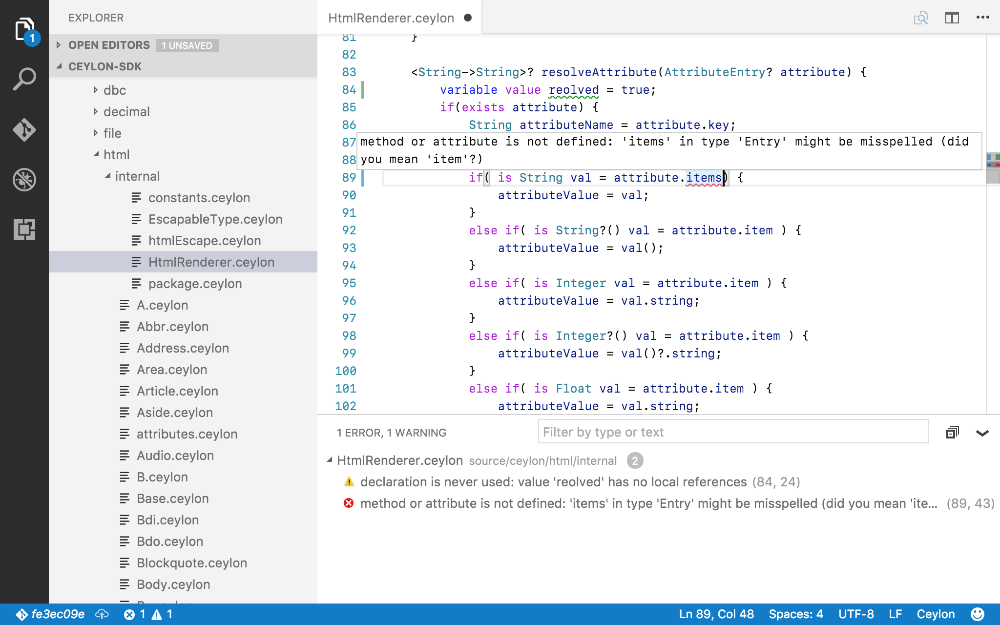
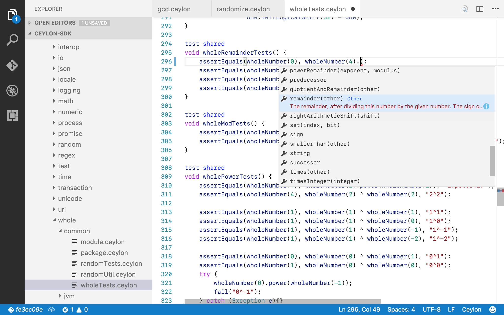
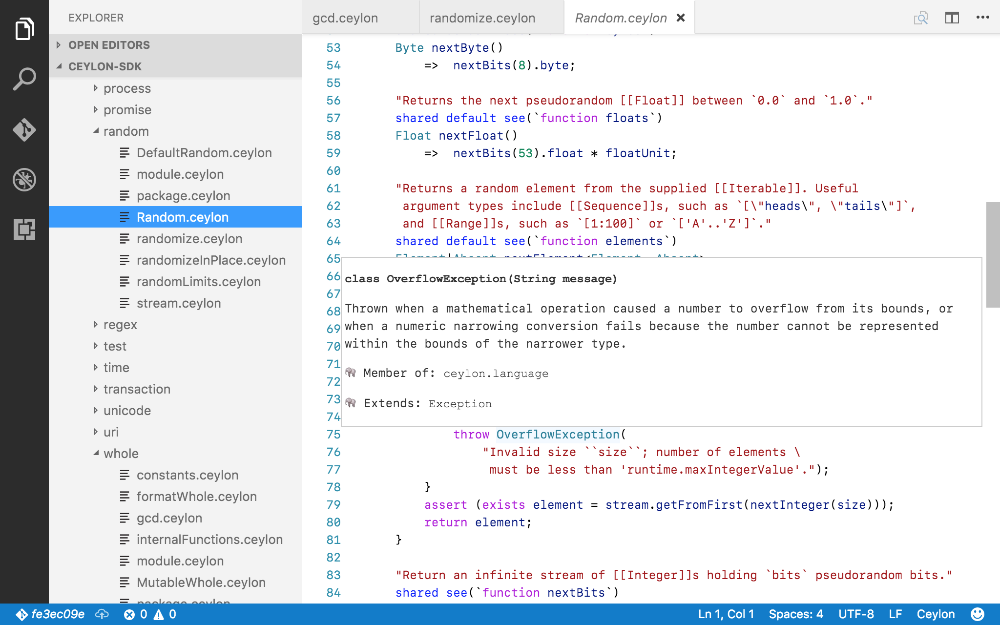

# Visual Studio Code Language Support for Ceylon

Provides support for editing and compiling Ceylon projects in Visual Studio
Code. Initially, the Dart backend on non-Windows operating systems is
supported.

## Features

- Zero-configuration: open any Ceylon project folder and start editing (`.ceylon/config`
will be used for configuration if present)
- Multithreaded compiles: the module you are editing is immediately recompiled after each
edit while dependent modules are compiled in the background
- Syntax highlighting
- As you type warning and error reporting

- Auto completion

- Documentation on hover


## Requirements

- [Ceylon 1.3.0](https://ceylon-lang.org) ([download](https://ceylon-lang.org/download/))
- [Dart backend for Ceylon DP3](https://github.com/jvasileff/ceylon-dart).
  Simple two step commandline installation:
  `ceylon plugin install --force com.vasileff.ceylon.dart.cli/1.3.0-DP3`
  then `ceylon install-dart --out +USER`
- [Visual Studio Code](https://code.visualstudio.com/Download)

To run programs on the Dart VM (optional), either
[download](https://www.dartlang.org/downloads/) Dart or install it using
Homebrew as described in the Dart backend for Ceylon
[readme](https://github.com/jvasileff/ceylon-dart).

## Installation

After satisfying the requirements, simply download the preview version of the
extension
([vscode-ceylon-0.0.0.vsix](https://jvasileff.github.io/vscode-ceylon/vscode-ceylon-0.0.0.vsix))
and open it in Visual Studio Code.

The extension must be able to find the `ceylon` 1.3.0 executable using one of
the following methods:

- Using `ceylon.home` configured within the Visual Studio Code settings (`⌘,`
  on macOS)
- Using the `CEYLON_HOME` environment variable
- Using the system `PATH`

## Extension Settings

This extension contributes the following settings:

* `ceylon.home`: The directory of the Ceylon installation to use.
* `ceylon.generateOutput`: Write compiled binaries to the output repository.
  Note that output is produced regardless of whether or not the source files
  have been saved.
* `ceylon.serverLogPriority`: The logging level for the language server.
* `ceylon.config.compiler.suppresswarning`: Override the suppresswarning
  setting.
* `ceylon.config.compiler.dartsuppresswarning`: Override the
  dartsuppresswarning setting.
* `ceylon.config.compiler.source`: Override the source repositories. Note that
  this will not take effect without restart.
* `ceylon.config.compiler.resource`: Override the resource repositories. Note
  that this will not take effect without restart.
* `ceylon.config.repositories.output`: Override the output repository
* `ceylon.config.repositories.lookup`: Override the lookup repositories

Note that the `ceylon.generateOutput` and `ceylon.config.*` settings are
intended to be used as workspace settings, but are entirely optional.

## Running and Testing Your Ceylon Program

In order to quickly run and test a module, it's recommended to enabled
`ceylon.generateOutput`, which is disabled by default. New binaries will be
created after every change, even for unsaved source files.

"Tasks" can easily be configured with Visual Studio Code to support calling
`ceylon compile-dart` (useful if `ceylon.generateOutput` is disabled) and
`ceylon run-dart`. It's of course possible to use tasks to call commands for other
backends too, for example, `compile-js`, `run-js`, and `test-js`.

A sample `tasks.json` to get you started:

```json
{
    // See https://go.microsoft.com/fwlink/?LinkId=733558
    // for the documentation about the tasks.json format
    "version": "0.1.0",
    "command": "ceylon",
    "isShellCommand": true,
    "suppressTaskName": true,
    "showOutput": "always",
    "tasks": [
        {
            "taskName": "compile",
            "args": ["compile-dart"],
            "isBuildCommand": true
        },
        {
            "taskName": "run",
            "args": ["run-dart", "com.example.mymodule"] 
        }
    ]
}
```

## Known Issues

This is pre-release software. Please report problems with steps to reproduce
using the [Github issue tracker](https://github.com/jvasileff/vscode-ceylon/issues).

Known issues and limitations include:

- Microsoft Windows is not currently supported
- Source directory configuration changes made in `.ceylon/config` and Visual
  Studio Code settings will not take effect until restart
- Completion and hover are not synchronized with builds, so stale incorrect
  information may be provided
- When `ceylon.generateOutput` is enabled, binaries are continuously produced,
  even for unsaved edits.

## Release Notes

### 0.0.0

The initial preview release.
